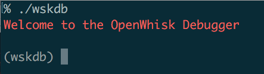
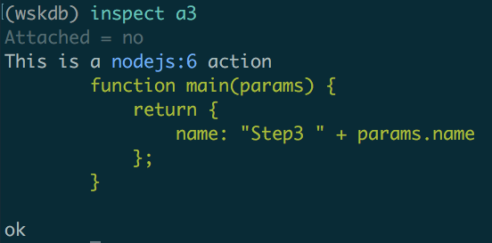
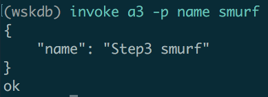
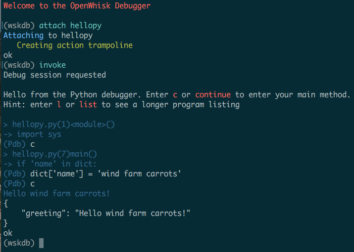

# OpenWhisk Debugger

This project currently supports debugging [OpenWhisk](https://console.ng.bluemix.net/openwhisk) actions written in NodeJS, Python, and Swift. The debugger will arrange things so that the actions you wish to debug will be offloaded from the main OpenWhisk servers and instead run on your laptop. You can then, from within the debugger, inspect and modify values. For NodeJS actions, you can even modify code and publish those changes back to the OpenWhisk servers.

The debugger currently supports inspecting an individual action, as well as invocations of this action as it occurs within **sequences** or **rules**. For example, if you have an OpenWhisk rule that fires a given action in response to a some trigger, you can attach to that action and debug, on your laptop, invocations triggered by the cloud.

## Usage

Start the debug client:



You will now be in the `wsdk` REPL. Issue `help` to see the list of available commands. 

Note: the first time you launch `wskdb`, you will experience a ~60 second delay, as the debugger finishes up the installation. This includes pulling in the package dependencies supported by OpenWhisk. These dependencies will allow you to debug actions that require one or more of the [packages supported by OpenWhisk](https://dev-console.stage1.ng.bluemix.net/docs/openwhisk/openwhisk_reference.html#openwhisk_ref_javascript). If you have already initialized the debugger, you can always choose to reinitialize it via `wskdb --reset`; this will reinstall the dependencies.

## Prerequisites

If you wish to debug NodeJS actions, you must currently have a version of NodeJS installed on your local machine that is compatible with the actions you wish to debug. `wskdb` currently does not attempt to employ `nvm` in order to leverage a runtime that matches the action being debugged.

If you wish to debug Swift actions, you must have `swiftc` and `lldb` installed. On MacOS, for example, you can acquire these by installing [XCode](https://itunes.apple.com/us/app/xcode/id497799835?mt=12).

If you wish to debug Python actions, you must have installed a version of Python compatible with 2.7.12. By default, the Python modules that OpenWhisk includes will not be installed locally. If you wish to set things up for debugging Python actions that depend on one or more of these modules, issue `wskdb --python` for your initial invocation. You can add Python support at any time by issuing `wskdb --reset --python`. You needn't pass the `--python` flag every time you use `wskdb`.

## Basic Commands: List, Inspect, Invoke

You can list your actions directly from within the debugger REPL.

]

Note that, in this session, the user had already attached to action `a3`. You may wish to inspect the details of an action, or invoke it prior to attaching. If you haven't yet attached to the action you are invoking, the invocation will proceed as if you weren't in the debugger, and had issued a blocking invocation from the CLI.




## Attaching to an action

You can attach to an attach on startup by passing the action name to the initial invocation. Say for example you wish to attach to an action `foo`:

```ShellSession
% ./wskdb foo
Attaching to foo
   Creating action trampoline
```

You may also choose to launch the debugger and attach to `foo` later:

```ShellSession
(wskdb) attach foo
Attaching to foo
   Creating action trampoline
```

If you wish to extend the instrumentation to include any containing rules or sequences (in this case, the action occurs in a sequence `seq`):

```ShellSession
(wskdb) attach foo --all
Attaching to foo
   Creating action trampoline
   Creating sequence splice seq
```

The short-hand for this is `-a`. 

## Modifying Code

If you are debugging a NodeJS action, you can elect to modify your code during a debug session. If you choose to do so, please be aware of the following bug in either the node-inspector or in NodeJS itself: if you modify the code of your action *after* it has been invoked, then hit Cmd/Ctrl-S to save your changes, this code change will not be reflected in that invocation, even though the code change itself will have registered.

Thus, please make any code changes prior to the debugger entering your action. When the debugger first starts up, you will be at a breakpoint *outside* of your action. This is your opportunity for modifying the code. Make your changes, hit Cmd/Ctrl-S to save them, then click Continue. You will now be in the body of your modified action, and those code changes will be reflected in the return value of the action when you Continue it through to completion.

Once you return to the `wskdb` REPL, you can choose to publish the changes back to the OpenWhisk servers:


## Getting Help

To learn more about the options for each command, you can issue a `-h` request, e.g.
```ShellSession
(wskdb) attach -h
Usage: attach [options]

	--help, -h
		Displays help information about this script

	--all, -a
		Instrument the action, plus any rules or sequences in which it takes part
```

## Choosing CLI versus Browser-based Debugging

By default, `wskdb` will prefer to use a browser-based debugger. If instead you wish to use a command-line debugger, pass the `--use-cli-debugger` option to `wskdb`; the short-hand form of this option is `-c`:

```ShellSession
% ./wskdb -c
Welcome to the OpenWhisk Debugger
    + Favor the CLI for debug sessions over a GUI
```

## Examples

### Python

This screenshot illustrates an example session of attaching, invoking, and debugging, a Python action.




## Notes on the Architecture

If you are curious as to the inner workings of the debugger, you can read more [here](docs/architecture/architecture.md). In short, `wskdb` operates by graph rewriting. In a way reminiscent of conventional debuggers, `wskdb` will install a *trampoline* that allows insertion of a breakpoint that re-routes invocations to your local machine.

### License

Copyright 2015-2016 IBM Corporation

Licensed under the [Apache License, Version 2.0 (the "License")](http://www.apache.org/licenses/LICENSE-2.0.html).

Unless required by applicable law or agreed to in writing, software distributed under the license is distributed on an "as is" basis, without warranties or conditions of any kind, either express or implied. See the license for the specific language governing permissions and limitations under the license.

### Issues

Report bugs, ask questions and request features [here on GitHub](../../issues).
