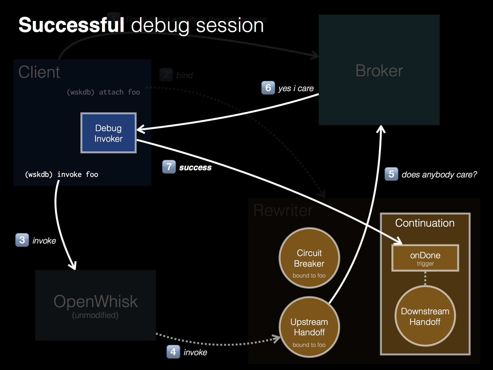

# OpenWhisk Debugger: Architecture

The OpenWhisk debugger is itself an OpenWhisk application. No changes were needed to the OpenWhisk core, in order to add this functionality. This design was possible, due to some of the unique features of OpenWhisk. First, let's discuss the design. Later, we can get into more detail of this meta-programming aspect of OpenWhisk.

When attaching to an action, the debugger creates a *trampoline* that allows managing of a breakpoint. This trampoline consists of five OpenWhisk actions --- note how the trampoline consists entirely of OpenWhisk constructs. At the top level, there are three important constructs, one of which has a few internal bits.

  1. The dispatcher, which manages the upstream handoff, from OpenWhisk to your laptop.
  2. The continuation, which manages the downstream handoff upon successful completion of the debugged action, from your laptop back to OpenWhisk.
  3. The circuit breaker, which manages the downstream handoff upon aborted completion of the debugged action.

We will continue to flesh out this section. 

